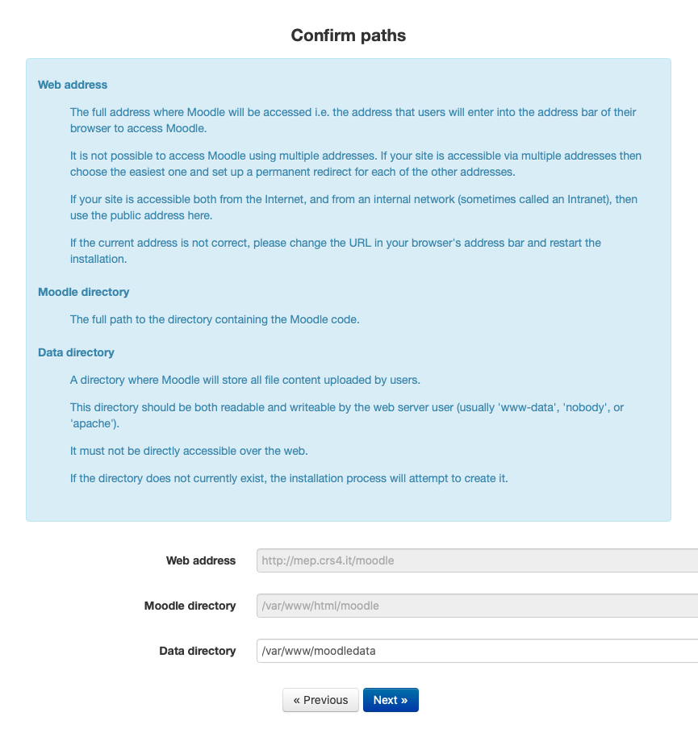
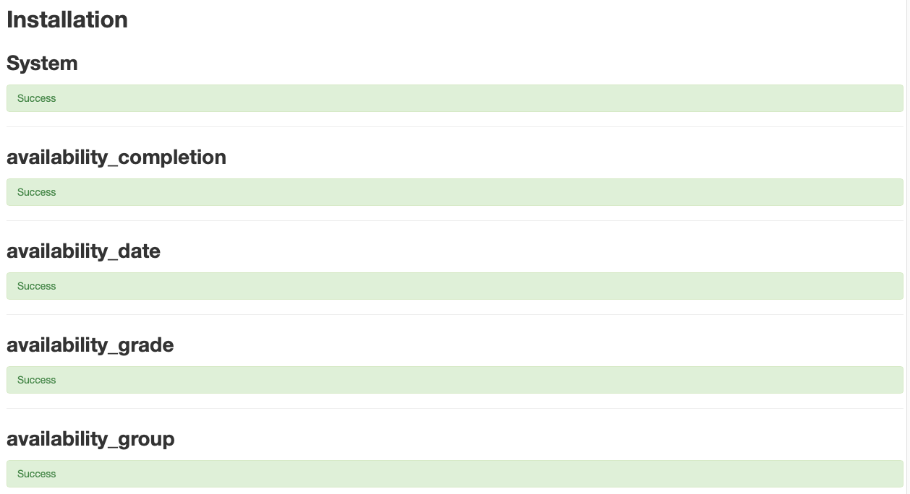

---

---

---

---

---

---

...

---

---

---
Enable the **Omero repository** plugin through the menu ''**Site Administration > Advanced features > Plugins > Repositories > Manage repositories**''

---

(\*) Complete the Omero Repository configuration accordingly to your setup of Omero + [OmeSeadragon](https://github.com/crs4/ome_seadragon).
